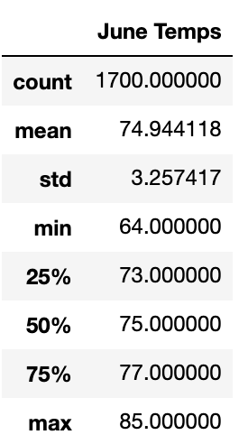
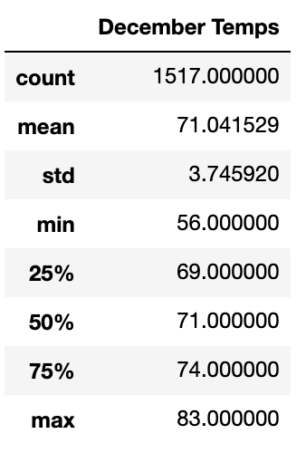

# surfs_up

## Overview
The purpose of this analysis is to provide more information about temperature trends, specifically for June and December in Oahu in order to determine if the surf and ice cream shop business is sustainable year-round.

## Results
- For June temperatures, the average is 74.94 degrees with a min of 64 and a high of 85 degrees.
- For December temperatures, the average is 71.04 degrees with a min of 56 and a high of 83 degrees. 
- The average temperature is around 4 degrees higher in June than December and there is a 8 degrees difference in the minimum temperature, but only a 2 degrees difference in the maximum temperature. 




## Summary

On a high level, we observed that the maximum temperatures in both June and December were not much in difference around 83 and 85 degrees. The lower temperatures were observed more in December with a variance of 9 for the minimum temperatures in June and December. Overall, both June and December experienced warmer days with December experiencing only a few colder days.

To look into precipitation:
```
results = session.query(Measurement.date, Measurement.prcp).filter(extract('month', Measurement.date) == 6).all()
```

```
results = session.query(Measurement.date, Measurement.prcp).filter(extract('month', Measurement.date) == 12).all()
```